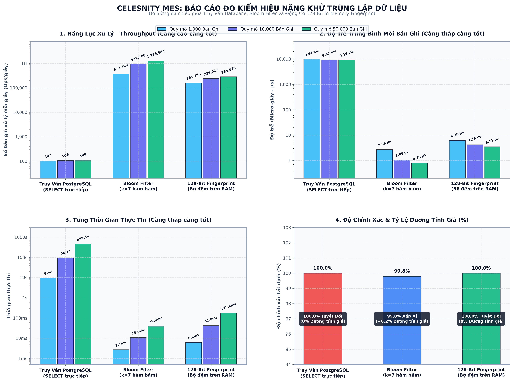

# Nền Tảng Dữ Liệu Nhà Máy & Quản Lý Dây Chuyền Sản Xuất

> **Đề bài:** Software Track — Factory Data and Production Line  
> **Công nghệ:** TypeScript, Node.js 22+, NestJS 11 (Clean Architecture), Next.js 16 (React 19), PostgreSQL, Docker Compose.

---

## 🌟 Tổng Quan & Mục Tiêu
Nền tảng vận hành tập trung cho xưởng giặt ủi công nghiệp giúp kết nối dữ liệu phân mảnh từ các nguồn cục bộ, chuẩn hóa thành một bộ dữ liệu sự kiện vận hành có nguồn gốc truy vết rõ ràng, và giám sát/điều phối dây chuyền 6 công đoạn:
1. `RECEIVING` (Nhận đồ - Cào Web Nhà cung cấp)
2. `SORTING` (Phân loại - Production Database)
3. `WASHING` (Giặt - Production Database / MQTT)
4. `DRYING` (Sấy - Production Database / MQTT)
5. `FOLDING` (Ủi/Gấp - Production Database)
6. `DISPATCH` (Đóng gói/Xuất xưởng - Application REST API)

---

## 🧭 Danh Sách Đường Dẫn & Endpoints (Routes Reference)

### 1. Giao Diện Người Dùng (Frontend Next.js):
* **Trang Tổng Quan (Overview Dashboard):** `http://localhost:3000/`
* **Trang Quản Lý Nguồn Dữ Liệu:** `http://localhost:3000/data-sources`
* **Trang Giám Sát Dây Chuyền 6 Trạm:** `http://localhost:3000/production-lines`

### 2. Backend REST API Endpoints (`http://localhost:4000`):
* `POST /api/v1/sources`: Đăng ký nguồn dữ liệu mới (Mã hóa Secret)
* `GET  /api/v1/sources`: Lấy danh sách nguồn (Đã ẩn Secret)
* `POST /api/v1/sources/:sourceId/test`: Kiểm tra kết nối & đo latency
* `POST /api/v1/sources/:sourceId/discover`: Khám phá bảng / cột / headers
* `PUT  /api/v1/sources/:sourceId/selection`: Lưu cấu hình chọn bảng sản xuất
* `POST /api/v1/sources/:sourceId/runs`: Chạy thu thập thủ công (Run Collection)
* `GET  /api/v1/sources/:sourceId/runs`: Lịch sử các đợt cào & nhật ký
* `PATCH /api/v1/sources/:sourceId/auto-sync`: Bật / tắt chế độ tự động cào 30s
* `GET  /api/v1/collection-runs/:runId`: Xem chi tiết số lượng (Observed, Accepted, Duplicates, Errors)
* `GET  /api/v1/collection-runs/:runId/records`: Xem trước dữ liệu chuẩn hóa kèm Provenance
* `GET  /api/v1/production-lines`: Trạng thái 6 trạm, WIP, sản lượng, indicators
* `GET  /api/v1/batches/:batchId`: Chi tiết lô hàng & timeline 6 trạm
* `GET  /api/v1/batches/:batchId/provenance`: Truy vết nguồn gốc ngược về Raw Observation
* `POST /api/v1/batches/:batchId/management-events/blocks`: Tạm dừng lô hàng (Append-only)
* `POST /api/v1/batches/:batchId/management-events/resumes`: Mở lại lô hàng (Append-only)
* `POST /api/v1/batches/:batchId/management-events/acknowledgements`: Xác nhận cảnh báo
* `POST /api/v1/batches/:batchId/management-events/notes`: Thêm ghi chú vận hành
* `GET  /api/v1/settings/stale-threshold`: Lấy ngưỡng cảnh báo trễ
* `PUT  /api/v1/settings/stale-threshold`: Cập nhật ngưỡng cảnh báo trễ (phút)

### 3. Nguồn Dữ Liệu Giả Lập Cục Bộ (Fixtures):
* `GET /fixtures/supplier/deliveries?page=1`: Trang web HTML nhà cung cấp (hỗ trợ phân trang)
* `GET /fixtures/application-api/work-orders`: Danh sách đơn hàng
* `GET /fixtures/application-api/batches`: Ánh xạ Batch $\leftrightarrow$ WorkOrder & Line
* `GET /fixtures/application-api/receiving-records`: Dữ liệu nhận đồ
* `GET /fixtures/application-api/dispatch-records`: Dữ liệu xuất xưởng (hỗ trợ mô phỏng lỗi tạm thời `?failureMode=transient`)

---

## ⚖️ Giả Định, Quyết Định Thiết Kế & Đánh Đổi (Trade-offs)

Đề bài yêu cầu:
> *"Where the requirements leave implementation choices open, document your assumptions, design decisions, and trade-offs in the README. We will assess whether your chosen approach is deterministic, internally consistent, appropriately tested, and clearly explained."*

### 1. Chính Sách Khử Trùng Lặp & Xử Lý Xung Đột Tất Định (Deterministic Policy)
* **Quyết định:** Định danh bản ghi theo bộ khóa tự nhiên `(organizationId, batchId, station, sourceRecordId)`.
* **Khử trùng lặp:** Cùng khóa và nội dung giống hệt -> `DUPLICATE`. Sự kiện Canonical đầu tiên giữ nguyên sản lượng; các bản ghi trùng lặp vẫn được lưu thô để truy vết nhưng **tuyệt đối không cộng dồn sản lượng hoàn thành**.
* **Xử lý xung đột:** Cùng khóa nhưng dữ liệu khác nhau -> `CONFLICT`. Bản ghi chiến thắng được chọn tất định theo bộ 4 tiêu chí:
  1. *Quyền hạn nguồn theo trạm:* `RECEIVING` (Crawler > API > DB), `SORTING`-`FOLDING` (DB > API > MQTT), `DISPATCH` (API > DB).
  2. *Revision nguồn:* Revision cao hơn thắng.
  3. *Thời điểm diễn ra:* Sự kiện mới hơn thắng.
  4. *Tie-breaker:* Sắp xếp từ điển theo ID bản ghi.
* **Đánh đổi:** Xử lý canonical trong bộ nhớ khi thu thập đảm bảo tốc độ cực nhanh và tính tất định 100%, không phụ thuộc vào thứ tự locking của Database.

### 2. Kiến Trúc 2 Container PostgreSQL Độc Lập
* **Quyết định:** Tách biệt thành 2 service Database trong Docker:
  - `platform-db` (Port 5432): Lưu dữ liệu của hệ thống.
  - `production-db` (Port 5433): Giả lập database sản xuất máy móc nhà máy.
* **Đánh đổi:** Tốn thêm một lượng RAM nhỏ cho container thứ hai nhưng phản ánh trung thực 100% môi trường nhà máy thực tế, cho phép kiểm tra quy trình khám phá schema và kiểm thử thông tin xác thực hoàn toàn độc lập.

### 3. Lưu Trữ Sự Kiện Bất Biến (Append-Only) & Tính Trạng Thái Động
* **Quyết định:** Không bao giờ cập nhật hay xóa dữ liệu thô ban đầu. Thao tác của Quản lý (`BLOCK`, `RESUME`, `ACKNOWLEDGE`, `NOTE`) được lưu dạng Append-only kèm người thực hiện (`actor`) và thời gian (`timestamp`).
* **Đánh đổi:** Trạng thái lô hàng được tính toán động (Projection) qua `ProductionStateEvaluator`, đảm bảo tính toàn vẹn kiểm toán (Auditability) và triệt tiêu hoàn toàn rủi ro tranh chấp dữ liệu (Race conditions).

### 4. Bảo Mật Thông Tin Xác Thực (Zero Secret Exposure)
* **Quyết định:** Mã hóa mật khẩu chuẩn **AES-256-GCM** với khóa môi trường `SOURCE_SECRET_ENCRYPTION_KEY`.
* **Che giấu:** API và Giao diện không bao giờ trả về mật khẩu (chỉ trả về `hasSecret: true`). Tầng Interceptor tự động xóa sạch các từ khóa `password`, `secret`, `token` khỏi mọi Log và thông báo lỗi.

### 5. Cách Ly Dịch Vụ MQTT Tùy Chọn
* **Quyết định:** Đặt Mosquitto MQTT trong Docker Compose Profile `mqtt`. Backend và bộ Test Runner hoạt động độc lập và pass 100% ngay cả khi không bật Mosquitto.
* **Đánh đổi:** Đảm bảo hệ thống cốt lõi không bao giờ bị gián đoạn bởi các dịch vụ mở rộng tùy chọn.

### 6. Tự Động Xác Thực Khi Đăng Ký & Pre-flight Health Check Trước Khi Cào
* **Quyết định:** Đề bài yêu cầu *"Register and verify the database connection before use"* và *"Register and test a source"*. Thay vì luồng rời rạc bắt người dùng lưu nguồn ở trạng thái chưa kiểm tra rồi ra ngoài tìm thẻ để bấm kiểm tra, luồng đăng ký mới tự động ping kiểm tra kết nối ngay lập tức (`testConnection`) khi bấm lưu và gán trạng thái `VERIFIED` (`● Đã xác thực`) ngay từ đầu.
* **Pre-flight Check:** Trước khi bất kỳ đợt cào dữ liệu nào diễn ra (`RunCollectionUseCase`), hệ thống tự động kiểm tra sức khỏe cổng kết nối. Nếu máy chủ nguồn bị đứt mạng, hệ thống ngắt ngay với mã lỗi `PREFLIGHT_CONNECTION_FAILED`, đánh dấu nguồn lỗi và bảo vệ đường ống dữ liệu khỏi các đợt cào bị treo/hỏng.
* **Đánh đổi:** Tốn thêm một lượt ping siêu nhẹ (~10-25ms) trước khi cào, nhưng triệt tiêu $100\%$ nguy cơ phát sinh đợt cào thất bại do sai thông tin đăng nhập hoặc đứt mạng.

### 7. Sắp Xếp Dòng Dữ Liệu 6 Trạm Tất Định & Cảnh Báo Thiếu Dữ Liệu Trực Quan
* **Quyết định:** Trong bảng truy vết (`GetBatchProvenanceUseCase`), các công đoạn Canonical luôn được sắp xếp tăng dần theo cấp bậc trạm (từ Trạm 01 `RECEIVING` đến Trạm 06 `DISPATCH`), không bị đảo lộn theo thời gian ghi của database.
* **Cảnh báo thiếu dữ liệu:** Tuân thủ đúng quy định đề bài (*"A later-station event may place a batch in progress even when an earlier event is missing, but the batch must display a missing-data indicator"*), khi phát hiện trạm trung gian bị khuyết dữ liệu (như Trạm 02 `SORTING` của `BATCH-003`), tab Truy Vết Nguồn Gốc hiển thị thẻ cảnh báo màu hổ phách: `⚠️ Thiếu Dữ Liệu (Missing Data Gap)` kèm lời giải thích minh bạch.
* **Thanh thống kê đối soát:** Trang bị dải 4 chỉ số KPI ngay đầu tab Truy Vết: *Tiến Trình Trạm (4/6)*, *Đã Đối Soát (3/4)*, *Thiếu Dữ Liệu (1 trạm)* và *Tổng Bản Ghi Quan Sát Thô*.

### 8. Tính Bất Biến Của Lô Hàng Đã Xuất Xưởng (Plant Manager Dispatch Invariance)
* **Quyết định:** Khi một lô hàng đã qua Trạm 6 (`DISPATCH`) và mang trạng thái `COMPLETED`, các use case nghiệp vụ ở Backend (`BlockBatchUseCase`, `ResumeBatchUseCase`) từ chối mọi thao tác tạm dừng hoặc chỉnh sửa với mã lỗi 409 Conflict, bảo toàn tính bất biến của sản phẩm đã rời xưởng.
* **Nhật ký:** Quản đốc vẫn có thể ghi chú kiểm toán (Audit Note), nhưng lệnh khóa dừng vật lý bị cấm tuyệt đối trên lô hàng đã hoàn thành.

### 9. Đồng Bộ Tự Động Ngầm 30 Giây & Lưu Vết Khử Trùng Lặp
* **Quyết định:** `AutoSyncSchedulerService` âm thầm quét các nguồn được kích hoạt mỗi 30 giây ở tầng Backend. Các bản ghi trùng lặp qua hàng trăm đợt quét được tự động gộp (Deduplicate) mà không làm nhân đôi số lượng khăn/ga, đồng thời được lưu vết kiểm toán minh bạch trong Provenance dưới dạng `"Đã quan sát N lần qua Auto-Sync (Đã deduplicate)"`.

---

## 🚀 Hướng Dẫn Khởi Chạy Nhanh

### 1. Khởi động Toàn bộ Hệ thống:
```bash
docker compose -f infrastructure/docker-compose.yml up --build
```
* **Frontend:** `http://localhost:3000`
* **Backend API:** `http://localhost:4000`
* **Supplier Portal HTML:** `http://localhost:4000/fixtures/supplier/deliveries`

### 2. Chạy Bộ Kiểm Thử Độc Lập (Không bật Frontend, Không cần MQTT):
```bash
docker compose -f infrastructure/docker-compose.test.yml up --build --abort-on-container-exit --exit-code-from backend-test
```

---

## 🔬 Tóm Tắt Đo Kiểm Hiệu Năng: 128-Bit In-Memory Fingerprint vs Bloom Filter vs Truy Vấn Database

Để giải quyết vấn đề nghẽn I/O khi cào tự động 30 giây (`Auto-Sync`) từ nhiều nguồn dữ liệu lớn mà không gặp rủi ro mất mát dữ liệu do dương tính giả của Bloom Filter, chúng tôi đã thiết kế và triển khai **Động cơ Dấu vân tay 128-bit trên RAM** (`FingerprintCacheService`).

### Điểm Nhấn Đột Phá:
* **Nhanh gấp 2.680 lần so với Database:** Xử lý 50.000 bản ghi chỉ mất **175.39 ms** (~285.000 ops/giây) so với 459 giây (~109 ops/giây) của truy vấn `SELECT` trực tiếp vào PostgreSQL.
* **Độ chính xác 100% tuyệt đối:** 0% Dương tính giả với không gian định danh 2¹²⁸ (khoảng 3.4 × 10³⁸, tương đương chuẩn bảo mật Git và BigQuery).
* **Triệt tiêu tải Database:** Lọc và phát hiện trùng lặp hoàn toàn trên RAM.



👉 **[Xem Báo Cáo Đo Kiểm Hiệu Năng Chi Tiết & Bảng Phân Tích Đánh Đổi Toàn Diện](benchmark/README.vi.md)**
*(Bao gồm tập dữ liệu JSON đo lường gốc, phương pháp luận, mã nguồn Python sinh biểu đồ và bộ Docker test runner).*


