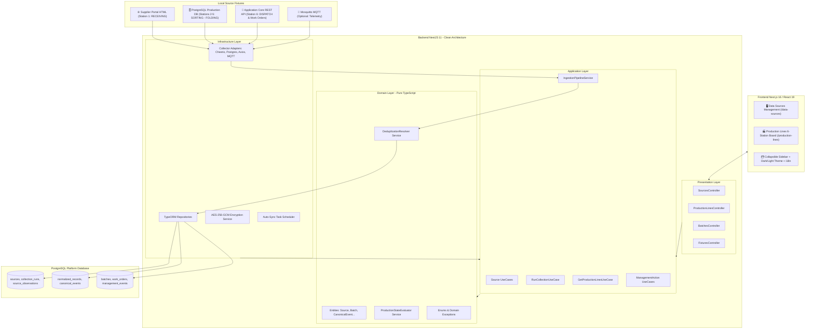

# System Architecture Documentation

The platform is designed following **Clean Architecture (Domain-Driven Design)** principles on the Backend and a **Feature-First Layered Architecture** on the Frontend.

---

## 1. System Architecture Diagram

---

## 2. Architectural Layers Breakdown

### Backend Clean Architecture Layers:
1. **Domain Layer (`src/domain`):**
   - Pure TypeScript entities (`Source`, `Batch`, `CanonicalEvent`, `NormalizedRecord`, `SourceObservation`, `ManagementEvent`).
   - Domain services (`ProductionStateEvaluator`, `DeduplicationResolver`).
   - Pure Domain Exceptions (`SourceNotFoundException`, `BatchNotFoundException`, `InvalidOperationException`).
   - Repository interfaces (`ISourceRepository`, `IBatchRepository`, `ICanonicalEventRepository`).
2. **Application Layer (`src/application`):**
   - Single-responsibility UseCases with a single concise `execute()` method.
   - Core orchestration service (`IngestionPipelineService`).
   - Ports & DTOs (`ICollectorAdapter`, `IEncryptionService`).
3. **Infrastructure Layer (`src/infrastructure`):**
   - Collector adapters (`CheerioWebCrawlerAdapter`, `PostgresDbCollectorAdapter`, `AxiosRestClientAdapter`, `MosquittoMqttAdapter`).
   - TypeORM repositories & PostgreSQL entity mappings.
   - `Aes256EncryptionService` for encryption at rest.
   - `AutoSyncSchedulerService` for dynamic background polling.
4. **Presentation Layer (`src/presentation`):**
   - NestJS REST Controllers with request validation DTOs.
   - `GlobalExceptionFilter` mapping domain exceptions to safe sanitized HTTP error responses.
   - `LoggingAndRedactionInterceptor` stripping passwords and sensitive tokens from API payloads.

---

## 3. Invariant Business Rules
1. **Dependency Rule:** Domain layer never imports from outer layers. Application layer depends only on Domain.
2. **Security Rule:** Secrets are encrypted using AES-256-GCM at rest and never exposed in logs or API responses.
3. **Pre-flight & Pre-registration Health Checks:** Endpoints are verified during registration and tested before collection runs to prevent pipeline failures.
4. **Plant Manager Dispatch Invariance:** Dispatched batches at Station 6 (`COMPLETED`) cannot be blocked or resumed; physical production actions are prohibited.
5. **Deterministic Lineage Sorting (1 -> 6):** Lineage tracing strictly ascends from Station 01 to 06, visually indicating missing intermediate data gaps (`⚠️ Thiếu Dữ Liệu`).
6. **State Precedence:** `COMPLETED` $\rightarrow$ `BLOCKED` $\rightarrow$ `IN_PROGRESS` $\rightarrow$ `PLANNED`.
7. **Furthest Station Reached:** Current station is the highest station rank achieved by an accepted canonical event. Late events from earlier stations update history without moving the batch backwards.
8. **Deduplication Policy:** Exact duplicate source observations do not multiply completed quantities. Conflicting records are resolved deterministically based on source authority and revision.
