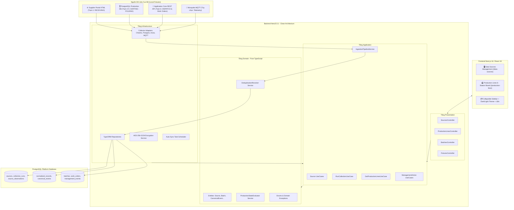

# Tài liệu Kiến trúc Hệ thống (System Architecture)

Hệ thống được thiết kế theo mô hình **Clean Architecture (Domain-Driven Design)** ở Backend và **Feature-First Layered Architecture** ở Frontend.

---

## 1. Sơ đồ Kiến trúc Tổng thể

---

## 2. Các Quy tắc Bất biến trong Kiến trúc
1. **Quy tắc Phụ thuộc (Dependency Rule):** Tầng Domain không bao giờ import từ các tầng ngoài. Tầng Application chỉ phụ thuộc vào Domain.
2. **Quy tắc Bảo mật:** Mật khẩu kết nối được mã hóa AES-256 trong Database và không bao giờ xuất hiện ở API response hay Log.
3. **Quy tắc Kiểm tra Sức khỏe (Pre-flight & Pre-registration):** Mọi nguồn đều được kiểm tra kết nối ngay khi đăng ký và tự động kiểm tra trước mỗi đợt cào dữ liệu để phòng ngừa sự cố đường ống.
4. **Bảo vệ Lô Hàng Đã Xuất Xưởng (Plant Manager Invariance):** Lô hàng đã xuất xưởng tại Trạm 6 (`COMPLETED`) không thể bị tạm dừng (BLOCK) hay can thiệp vận hành; sản phẩm đã hoàn thành có tính bất biến tuyệt đối.
5. **Thứ Tự Dòng Dữ Liệu Tất Định (1 ➔ 6):** Bảng truy vết (Provenance) luôn sắp xếp công đoạn tăng dần từ Trạm 01 đến 06, trực quan hóa rõ ràng các công đoạn thiếu dữ liệu (`⚠️ Thiếu Dữ Liệu`).
6. **Quy tắc Trạng thái Dây chuyền:**
   - Lô hàng không bao giờ bị lùi trạm (`Never move backwards`).
   - Thứ tự ưu tiên trạng thái: `COMPLETED` $\rightarrow$ `BLOCKED` $\rightarrow$ `IN_PROGRESS` $\rightarrow$ `PLANNED`.
   - Khử trùng lặp sản lượng hoàn thành (`Deduplicated completed quantity`).
   - Đồng bộ ngầm 30 giây với lưu vết khử trùng lặp minh bạch.
